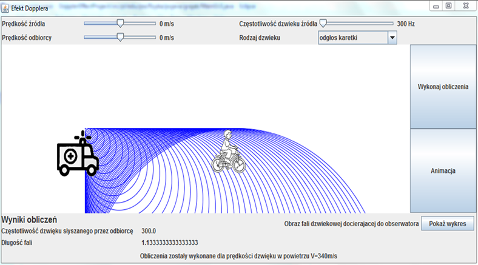

# DopplerEffect
Java project made with colleague that show a Doppler Effect  

The project was created to bring the Doppler Effect closer to the user. 
Program show an animation represent a Doppler Effect. It also  allows to know the wavelength and frequency reaching the observer at known speeds of both the observer and the source

